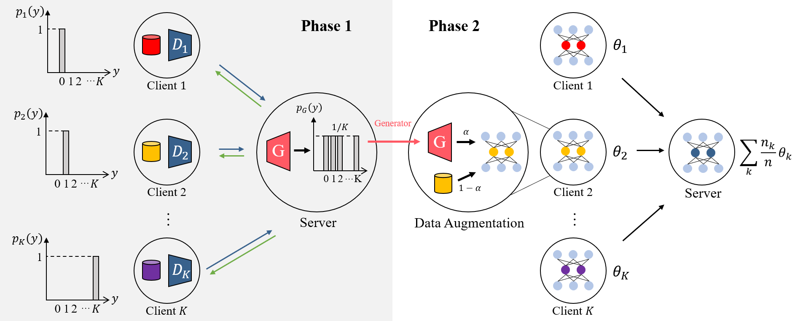
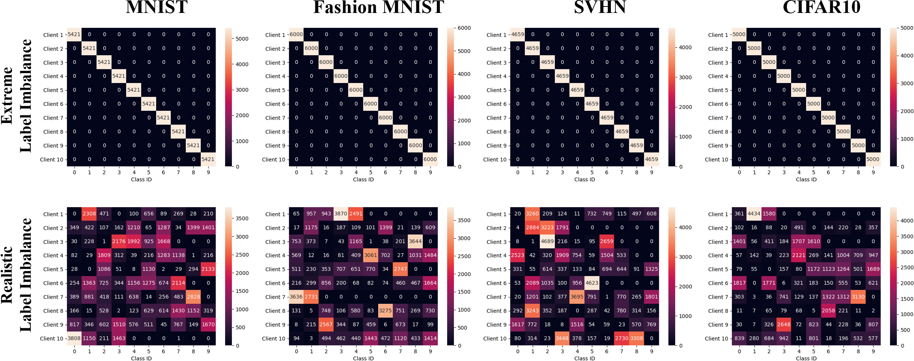

# Conditional Data Augmentation for Federated Learning with Non-IID data

This is an official pytorch implementation for "Conditoinal Data Augmentation for Federated Learning with Non-IID data" that is submitted to ICML 2022.

## Requirements
To install requirements:

``` 
conda env create -f environment.yaml 
```

- The conda environment is established on Ubuntu 18.04.
If you are using Windows, you may reinstall some libraries according to error message.
- Please change the 'prefix' in the 'environment.yaml' to your anaconda directory.


<br/>

## Pretrained conditional GAN checkpoints

You can download pre-trained cGAN checkpoints (.pt) from the below link.
https://drive.google.com/drive/folders/1EnmGRXFh-gH9brBafgQbXlswWfXlMWHc?usp=sharing

Copy downloaded checkpoint files to proper directory under 'src/gen_ckpt/'.


<br/>

## Dataset download


You can download splited dataset from the below link.
https://drive.google.com/drive/folders/1GPls0j7IHKaezOCGKYDC35FaepfW26CM?usp=sharing

Copy downloaded dataset folders under 'split_dataset'.


<br/>

## The second phase training (FedAvg, FedProx)
Suppose that there is a server that is connected to 10 clients.
We will provide sample code to execute the federated learning on one device, but you can use this repository to apply federated learning in real situation thanks to Flower.
To train a global classifier using the proposed conditional augmentation with FedAvg, 

<br/>

1. Open a terminal for the server and execute:

   ``` 
   python -m src.federated.server
   ```

   args:
   - server_address: IP address and port number of the server. ex) localhost:8080
   - num_rounds: The number of rounds for federated learning
   - num_clients: The number of clients that participate in federated learning
   - sample_ratio: Client sampling ratio

<br/>

2. Open a terminal for each client and execute:

   ```
   python -m src.federated.ca_fedavg_client.py
   ```

   args:
   - server_address: IP address and port number of the server. This should be the same with the server. ex) localhost:8080
   - data: One of MNIST / fMNIST / SVHN / CIFAR10
   - split_mode: One of extreme / dirichlet
   - subset: The ID for client and splited dataset. Give different integer between 0 and 9 to each client.
   - real_percentage: The augmentation ratio between 0 and 1.
   - lr: Learning rate for federated learning


<br/>

Example of execution (the proposed method for MNIST with extreme label imbalance and sampling ratio 0.5)
```
# server terminal
python -m src.federated.server --server_address=localhost:8085 --sample_ratio=0.5

# client 0 terminal
python -m src.federated.ca_fedavg_client.py --server_address=localhost:8085 --data=MNIST --split_mode=extreme --subset=0 --real_percentage=0.9

# client 1 terminal
python -m src.federated.ca_fedavg_client.py --server_address=localhost:8085 --data=MNIST --split_mode=extreme --subset=1 --real_percentage=0.9

...

# client 9 terminal
python -m src.federated.ca_fedavg_client.py --server_address=localhost:8085 --data=MNIST --split_mode=extreme --subset=9 --real_percentage=0.9
```

<br/>
If you want to play with FedAvg, FedProx and the proposed method with FedProx, change the execute command for each client as followings:

```
# For the proposed method with FedProx
python -m src.ca_fedprox_client --server_address=localhost:8085 --data=MNIST --split_mode=extreme --subset=0 --real_percentage=0.9 --mu=1e-2

# For the FedAvg
python -m src.fedavg_client --server_address=localhost:8085 --data=MNIST --split_mode=extreme --subset=0

# For the FedProx
python -m src.fedavg_client --server_address=localhost:8085 --data=MNIST --split_mode=extreme --subset=0 --mu=1e-2
```
